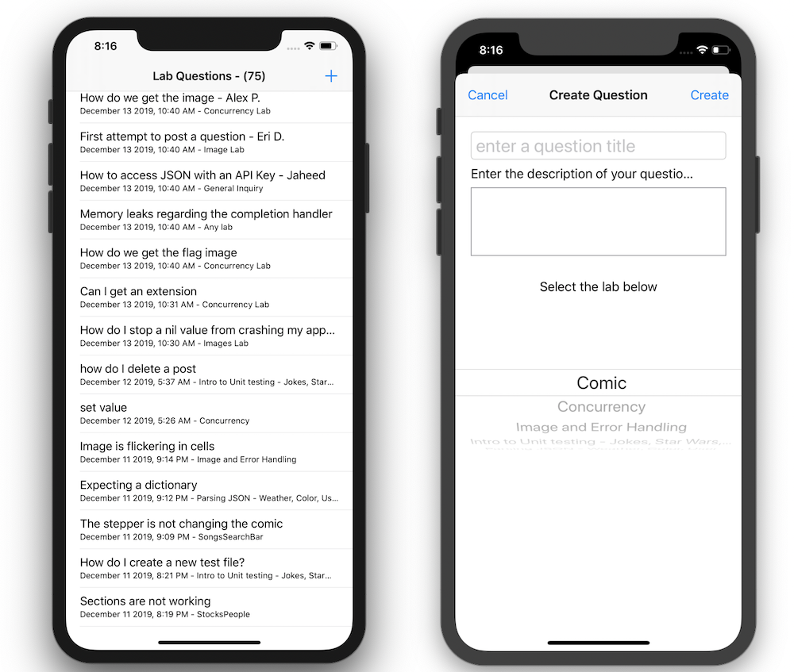

# LabQuestions

Making POST Requests (Uploading Data to a Web API). In this app we will making POST request to create lab questions we may have. We will also be making a GET requests to get all lab questions posted to the web api. 

Updated: user can POST an answer to a question, user can view all answers to a question.

